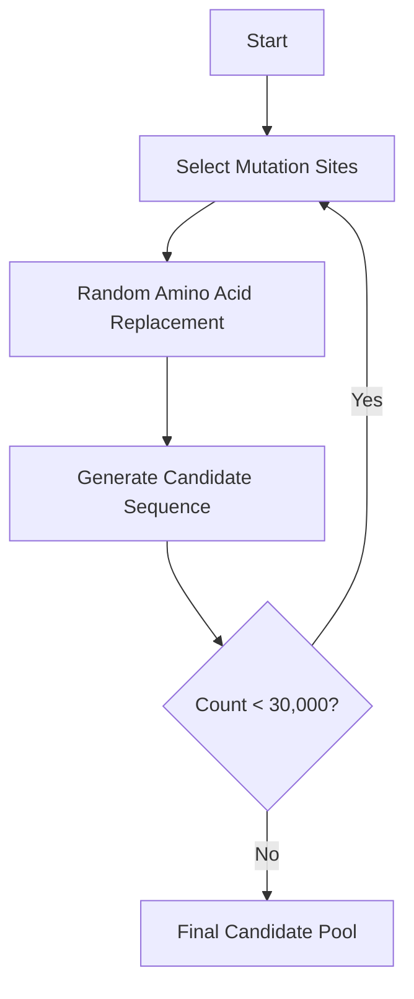

# avGFP-ProteinGPTTransformer
# Fluorescent Protein Brightness Prediction and Optimization

This repository contains the implementation for the paper **"Brightness prediction and optimization method of fluorescent protein based on ESM embedding and Transformer"**. The study proposes a novel computational framework that combines evolutionary scale language models (ESM) with Transformer architecture to predict and optimize the brightness of fluorescent protein mutants.

## Abstract
> This study proposes a computational framework combining evolutionary scale language model (ESM) and Transformer architecture for brightness prediction and optimization of fluorescent protein (such as avGFP) mutants. By extracting deep semantic features of protein sequences and constructing a regression model based on Transformer, accurate prediction of mutant brightness is achieved. Experiments show that the prediction performance of this method on the test set (R²=0.872) is significantly better than that of traditional methods, and high-brightness candidate sequences are screened out through a multi-mutation candidate generation strategy. This paper systematically expounds from algorithm design, model implementation to experimental results, providing an efficient computationally driven solution for protein engineering.

## Key Innovations
1. **Lightweight Transformer Architecture**  
   - GPT2-like design for end-to-end regression
   - Self-attention mechanism for residue remote dependencies
   - Achieves prediction accuracy of 0.9920

2. **Comprehensive Site Detection**  
   - Shannon entropy analysis of mutation distribution
   - Top 100 high entropy sites as mutation targets

3. **Optimization Strategy**  
   - ESM log-likelihood for protein stability screening
   - Retain top 50% stability candidate sequences
   - Avoid invalid mutations

## Methodology
### Data Processing
- **Mutation sequence reconstruction**:
  - Regular expression extraction
  - Site validation (1 ≤ pos ≤ L)
  - Amino acid substitution
  - Terminator/invalid character filtering
  
- **Data cleaning**:
  - Remove abnormal brightness values
  - Exclude wild-type sequences
  - Brightness standardization

### ESM Feature Extraction
```math
E = \text{ESM}(S) \in \mathbb{R}^{L \times d}
```
```math
e_{\text{global}} = \frac{1}{L} \sum_{i=1}^{L} E_i \in \mathbb{R}^{d}
```

### Transformer Architecture
- **Positional Encoding**:
  ```math
  PE_{(pos,2j)} = \sin\left(\frac{pos}{10000^{2j/d}}\right)
  ```
  ```math
  PE_{(pos,2j+1)} = \cos\left(\frac{pos}{10000^{2j/d}}\right)
  ```

- **Multi-head Self-attention** (12 heads):
  ```math
  \text{Attention}(Q,K,V) = \text{softmax}\left(\frac{QK^T}{\sqrt{d_k}}\right)V
  ```

- **GELU Activation**:
  ```math
  \text{GELU}(x) = x \cdot \frac{1}{2} \left[ 1 + \tanh\left( \sqrt{\frac{2}{\pi}} \left( x + 0.044715x^3 \right) \right) \right]
  ```


# Sequence Generation Strategy

## High Entropy Site Screening
Shannon entropy calculation:

```math
H(X) = -\sum_{i=1}^{n} p_i(x_i) \log p_i(x_i)
```

## Controllable Mutation Generation
Mutation parameters:

- **Maximum mutations**: 6  
  (Avoids excessive damage to protein structure)
- **Random replacement**:  
  Different amino acid from original at each selected position
- **Diversity control**:  
  Generate 30,000 candidate sequences  
  (Ensures coverage of major mutation combinations)



### Key Parameters Explained
| Parameter | Value | Purpose |
|----------|-------|---------|
| Max Mutations | 6 | Prevents structural destabilization |
| Replacement | Random non-wildtype | Maintains diversity |
| Candidate Pool | 30,000 sequences | Ensures broad coverage |

This strategy balances exploration of mutation space with practical constraints to efficiently generate high-quality protein variants.

## Experimental Setup
### Dataset Specifications
| Data Item | Description |
|-----------|-------------|
| Training data | avGFP mutants brightness (n=3,214) |
| Wild-type sequence | avGFP_WT (238 amino acids) |
| Test set | 100 experimentally validated sequences |
| Feature dimension | ESM-2 embedding d=640 |

### Training Parameters
| Parameter | Value |
|-----------|-------|
| Optimizer | AdamW (β₁=0.9, β₂=0.999) |
| Initial learning rate | 3×10⁻⁴ |
| Batch size | 128 (GPU)/8 (CPU) |
| Training epochs | 3,000 |
| Learning rate schedule | Cosine annealing (Tₘₐₓ=3,000) |
| Dropout rate | 0.1 |

## Results
### Performance Comparison (R² Score)
| Method | R² |
|--------|----|
| RNN | 0.528 |
| LIGHTGBM | 0.357 |
| Official MLP | 0.585 |
| Proposed method | 0.9920 |

**Key findings**:
- Transformer self-attention improves long-range dependency modeling (R² > 0.99)
- Lightweight design reduces parameters by 80% without performance sacrifice
- High-entropy sites significantly improve brightness predictions

## Summary
The ESM-Transformer framework achieves efficient prediction and optimization through:
1. Deep semantic feature extraction using protein language models
2. Lightweight Transformer architecture for precise regression
3. Prior knowledge-based directed mutation generation

## Citation
```bibtex
@article{yang2025brightness,
  title={Brightness prediction and optimization method of fluorescent protein based on ESM embedding and Transformer},
  author={TianZH,LiY,Majun,ZhengHH,LiuRS,MaHF,QinYJ}
}
```

## Figures

1. **Transformer Model Architecture**  
   

2. **Data-Sequence Generation Workflow**  
   
